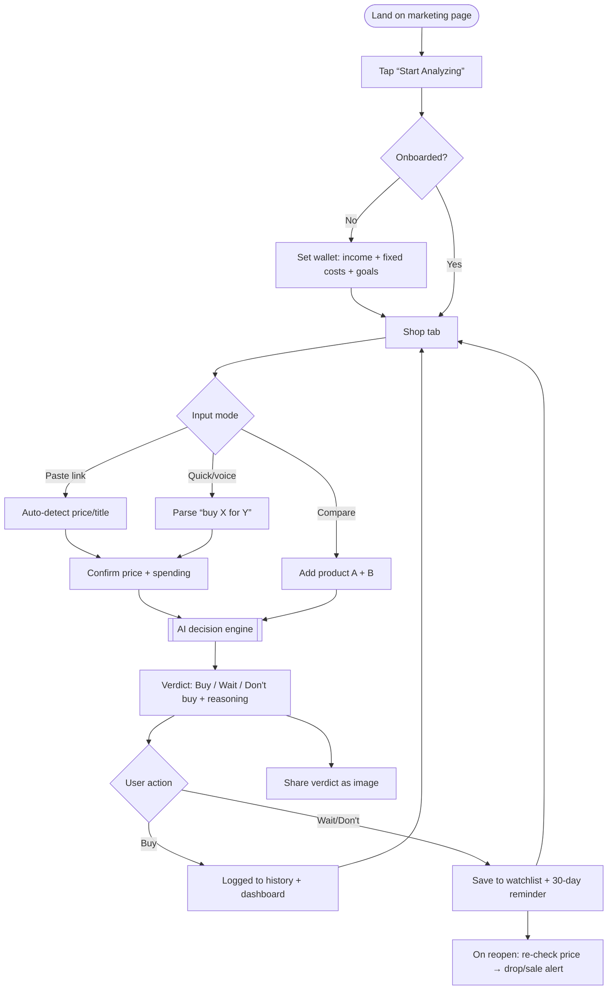
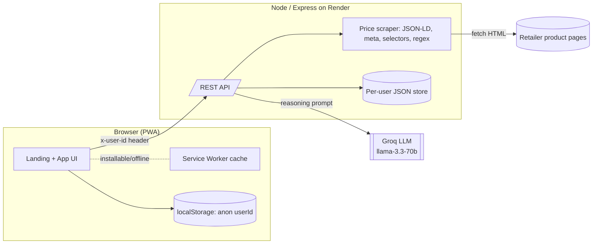
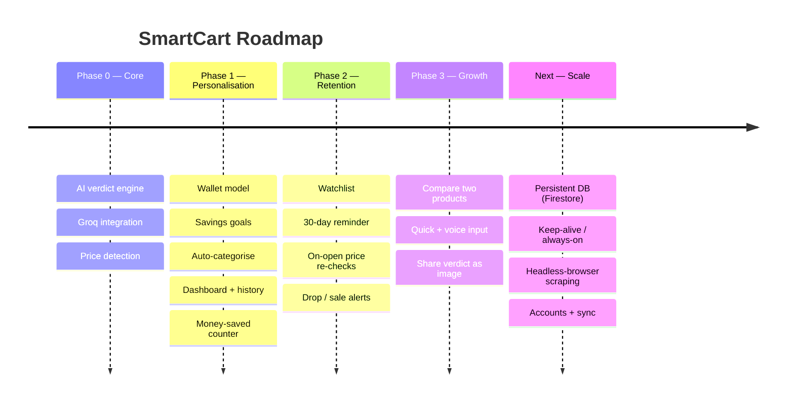
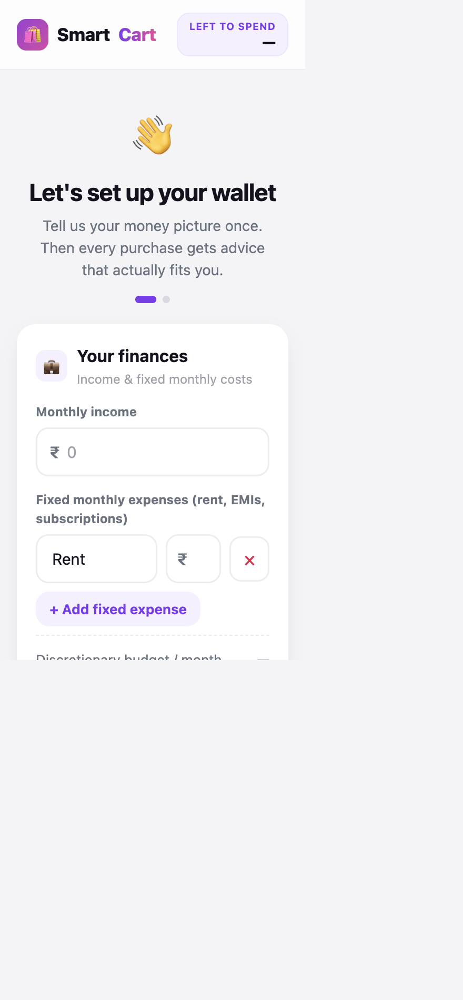
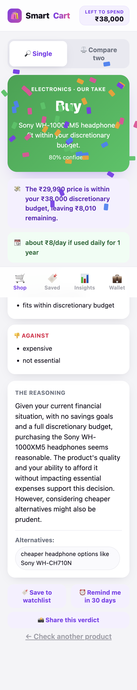
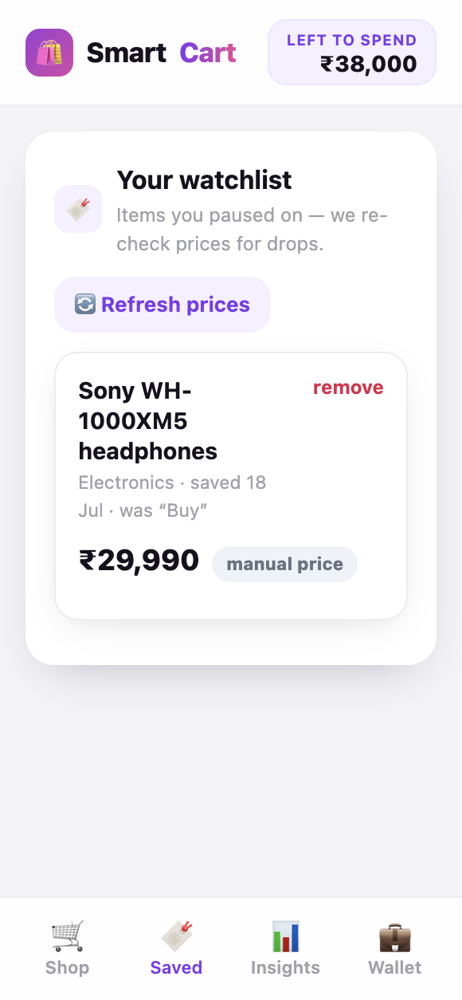
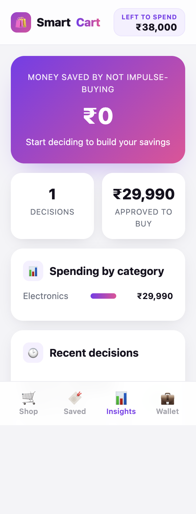
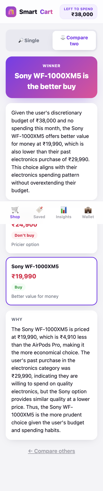

# SmartCart — Product Requirements Document & Case Study

> **"Should I actually buy this?"** — an AI decision assistant that reasons over your real budget, spending and goals to give an objective **Buy / Wait / Don't buy** verdict.

| | |
|---|---|
| **Live app** | https://smartcart-c2ci.onrender.com |
| **Repository** | https://github.com/AASTHA381/SmartCart |
| **Author** | Aastha Saini |
| **Status** | MVP shipped (Phases 1–3 live) |
| **Type** | 0→1 consumer fintech / AI-native product |
| **Doc version** | 1.0 |

---

## 1. TL;DR (Loom-style walkthrough script)

> *Hey — this is SmartCart. The problem I kept seeing is that online shoppers don't lack price information, they lack **judgement at the moment of purchase**. Every store is engineered to make you say yes. So I built the opposite: a neutral second opinion.*
>
> *You set your money picture once — income, fixed costs, savings goals. Then you paste any product link or just type "Should I buy AirPods for 20k?". SmartCart pulls the price, weighs it against what's actually left in your discretionary budget, how it delays your goals, and even cost-per-use — then gives you a clear Buy, Wait, or Don't buy with the reasoning shown, not hidden.*
>
> *It also remembers your history, tracks a watchlist for price drops, does a 30-day cool-off reminder, and can compare two products head-to-head. It's AI-native — the value is the reasoning over your data, not a calculation. And it's honest by design: no ads, no affiliate cut, it will happily tell you to wait.*

**Elevator pitch:** *A financial conscience for your cart — objective purchase advice in seconds.*

---

## 2. Problem Statement

Online shopping is optimised to **convert**, not to help you decide well. Shoppers are flooded with persuasion (urgency timers, "you saved ₹X", reviews, EMIs) but have **no neutral tool** that answers the only question that matters at checkout: *given my money and my goals, is this actually worth it right now?*

**The core problem:**
> People don't lack product/price information. They lack **contextual judgement** at the point of purchase — a way to weigh a specific buy against their own budget, priorities and future goals.

**Why it matters (evidence & signals):**
- Impulse spending is a top driver of personal-finance regret, especially for students and early-career professionals with tight discretionary budgets.
- Existing tools are siloed: budgeting apps look *backward* (what you spent), price trackers only tell you the *number*, and store recommendations are *conflicted* (they want the sale).
- The decision is emotional and time-pressured — a 10-second, trustworthy "sanity check" is missing from the funnel.

**Problem hypothesis:**
> If shoppers get an *objective, personalised, reasoned* verdict at the moment of decision, they will avoid regretful purchases and feel more in control — enough to return to the tool repeatedly.

---

## 3. Research

### 3.1 Method
Lightweight, scrappy discovery appropriate for a 0→1 build:
- **Problem interviews** (informal) with peers — MBA students & early-career professionals.
- **Competitive teardown** of adjacent tools.
- **Behavioural framing** from known personal-finance heuristics (30-day rule, cost-per-use, opportunity cost).

### 3.2 Key insights
| # | Insight | Product implication |
|---|---------|---------------------|
| 1 | People *know* they overspend but can't judge a single purchase in the moment. | Deliver a **fast, in-the-moment verdict**, not a monthly report. |
| 2 | "Is it worth it?" is relative to *their* budget, not the price. | Anchor advice to **discretionary budget & goals**, not absolute cost. |
| 3 | Trust collapses if the tool feels like it wants a sale. | **No ads, no affiliate links**; willing to say "don't buy". |
| 4 | A number alone doesn't persuade; the *reasoning* does. | Always **show the logic** (pros, cons, budget impact). |
| 5 | Impulse fades with time. | **30-day cool-off reminder** + watchlist. |
| 6 | Friction kills usage. | **No login**; anonymous per-device identity; paste-a-link. |

### 3.3 Competitive landscape
| Product | What it does | Gap SmartCart fills |
|---|---|---|
| Budgeting apps (e.g. Mint-style) | Track past spending | Backward-looking; no per-purchase decision |
| Price trackers (e.g. Keepa-style) | Show price history | Only the number; ignores *your* budget |
| Store recommendations | Suggest more to buy | Conflicted incentive (wants the sale) |
| Generic AI chatbots | Answer anything | Not grounded in your budget/goals; not a workflow |
| **SmartCart** | **Reasoned Buy/Wait/Don't-buy on your money** | **Objective + personalised + in-the-moment** |

**Positioning:** *The neutral second opinion between "add to cart" and "pay".*

---

## 4. User Personas

### Primary — "Budget-conscious Bhavya" 🎯
| Attribute | Detail |
|---|---|
| Who | 24, MBA student / early-career professional, urban India |
| Income | ~₹40–70k/month, meaningful fixed costs (rent, EMIs) |
| Behaviour | Shops online weekly; tempted by sales; saving for a goal (laptop, trip) |
| Pain | "I can afford it… but *should* I? Am I derailing my savings?" |
| Goal | Feel in control; avoid regret; still enjoy justified treats |
| Wins with SmartCart | Instant, honest gut-check tied to *their* numbers |

### Secondary — "Impulse Ishaan" 🛒
| Attribute | Detail |
|---|---|
| Who | 21, student, low discretionary budget |
| Behaviour | Late-night impulse buys, buyer's remorse |
| Pain | Spends before thinking; no cool-off mechanism |
| Wins with SmartCart | "Wait" verdict + 30-day reminder + money-saved counter |

### Anti-persona
High-income, low-friction spenders who don't want budgeting friction — **not** the target.

---

## 5. Goals & Success Metrics

### North Star Metric
> **Confident decisions made** = number of purchase verdicts a user acts on (buys a "Buy", or skips/paused a "Wait"/"Don't buy").
It captures the core value: *helping people decide well*, not just visit.

### Supporting metrics (proposed targets for a real launch)
| Category | Metric | Target |
|---|---|---|
| **Activation** | % of new users who complete onboarding + 1st verdict | ≥ 60% |
| **Engagement** | Avg verdicts / active user / week | ≥ 3 |
| **Retention** | W4 retention | ≥ 25% |
| **Value proof** | "Money saved" (sum of paused/avoided buys) per user | Trending up |
| **Trust** | % verdicts where reasoning is expanded/read | ≥ 70% |
| **Watchlist** | % of "Wait"/"Don't buy" items saved | ≥ 30% |
| **Virality** | Verdict share actions / week | Trending up |

### Guardrail metrics
- Verdict latency < 3s (p90).
- Price auto-detect success rate on supported sites.
- Zero exposure of secrets / user data (privacy guardrail).

---

## 6. Solution & MVP Scope

**Solution:** A mobile-first PWA that turns any product into a personalised, reasoned purchase verdict, wrapped in a lightweight money-management workflow.

### MVP (shipped)
| Capability | Description |
|---|---|
| 🧠 **Reasoned verdict** | Buy / Wait / Don't-buy + confidence, headline, pros/cons, reasoning |
| 💼 **Wallet model** | Income + fixed costs → discretionary budget (set once) |
| 🎯 **Savings goals** | Verdict shows how a buy delays goals |
| 🏷️ **Price auto-detect** | Paste a link → server scrapes price/title/image (best-effort) |
| 💬 **Quick / voice input** | "Should I buy X for 20k?" parsed + spoken input |
| ⚖️ **Compare two** | Head-to-head winner for your budget |
| 🔖 **Watchlist** | Save items, 30-day reminder, price-drop re-checks |
| 📊 **Dashboard** | Money saved, spending by category, history |
| 📸 **Share** | Export verdict as an image |
| 🔒 **No-login privacy** | Anonymous per-device identity |

### Explicitly out of scope (MVP)
- Accounts / cross-device sync, bank integrations, real-time push notifications, guaranteed scraping of bot-protected retailers (Amazon/Flipkart), native apps.

---

## 7. User Flow (Flowchart)



---

## 8. System Architecture (Flowchart)



**Key design decisions**
- **API key server-side only** — the browser never sees the LLM key (OWASP: no secrets in client).
- **Anonymous per-device ID** — multi-user without login; data isolated by an unguessable ID (path-traversal-sanitised on the server).
- **On-open price re-checks** (throttled) instead of a cron — pragmatic for a free host that sleeps.
- **Best-effort scraping** with graceful manual fallback — big retailers block bots; the product degrades gracefully instead of failing.

---

## 9. Wireframe (low-fidelity) → high-fidelity

Low-fi concept of the core **decision** screen:

```
┌───────────────────────────────┐
│  🛍️ SmartCart      Left: ₹8,010│  ← wallet balance always visible
├───────────────────────────────┤
│ [ 🔎 Single ] [ ⚖️ Compare ]   │  ← mode toggle
│ 💬 "Should I buy ___ for ___?" 🎤│  ← quick / voice ask
│ ┌───────────────────────────┐ │
│ │ Product link ______ [Detect]│ │
│ │ [ product image + price ]  │ │  ← auto-detected card
│ └───────────────────────────┘ │
│ Spent this month ▸ tally      │
│ [   🤔 Should I buy it?     ]  │  ← primary CTA
├───────────────────────────────┤
│  🛒 Shop  🔖 Saved  📊  💼     │  ← bottom nav
└───────────────────────────────┘
```

The shipped high-fidelity UI is shown in **Section 11**.

---

## 10. Roadmap



| Phase | Theme | Status |
|---|---|---|
| 0 | Core decision engine | ✅ Shipped |
| 1 | Personalisation & insights | ✅ Shipped |
| 2 | Retention (watchlist, reminders, drops) | ✅ Shipped |
| 3 | Growth (compare, voice, share) | ✅ Shipped |
| Next | Persistence, always-on, robust scraping, accounts | 🔜 Planned |

---

## 11. Screenshots

### Marketing landing page


### Onboarding — set your wallet (once)


### The reasoned verdict


### Watchlist — saved items & price tracking


### Dashboard — money saved, categories, history


### Compare two products head-to-head


---

## 12. Key Decisions & Trade-offs (PM judgement)

| Decision | Options considered | Choice & why |
|---|---|---|
| **Auth model** | Full login vs anonymous | **Anonymous per-device** — removes activation friction; privacy by default. Trade-off: no cross-device sync (accepted for MVP). |
| **LLM provider** | Anthropic (paid) → Groq (free) | **Groq** — zero-cost, fast, good reasoning; keeps the product free. |
| **Price detection** | Headless browser / paid API / static scrape | **Best-effort static scrape + manual fallback** — cheap and works on many sites; big retailers gracefully degrade to manual entry. |
| **Notifications** | Cron + push vs in-app | **In-app, on-open re-checks** — reliable on a free host that sleeps; no infra. |
| **Storage** | DB vs JSON files | **JSON per-user** for MVP speed; DB is the next step (ephemeral on free tier is the known trade-off). |
| **Confidence score** | Hard rubric vs model judgement | Model judgement for MVP; transparent rubric flagged as a future trust upgrade. |

---

## 13. What I'd do next (prioritised)

1. **Persistent storage (Firestore)** — so watchlist/history survive restarts. *(reliability)*
2. **Transparent confidence rubric** — show *why* it's 80% (affordability, need, timing bars). *(trust)*
3. **Headless-browser / paid-API scraping** — reliable prices on Amazon/Flipkart. *(coverage)*
4. **Accounts + cross-device sync** — once retention justifies the friction. *(scale)*
5. **Opportunity-cost & "money saved" gamification** — deepen the behavioural hook. *(engagement)*

---

## 14. Appendix — Tech at a glance

- **Frontend:** Vanilla JS PWA (installable, offline shell), mobile-first, no build step.
- **Backend:** Node + Express; endpoints for `/api/decide`, `/api/compare`, `/api/price`, `/api/profile`, `/api/goals`, `/api/history`, `/api/watchlist`.
- **AI:** Groq `llama-3.3-70b-versatile`, structured JSON output.
- **Hosting:** Render (web service, auto-deploy on push).
- **Security:** API key server-side only; sanitised anonymous IDs; no third-party data selling.
